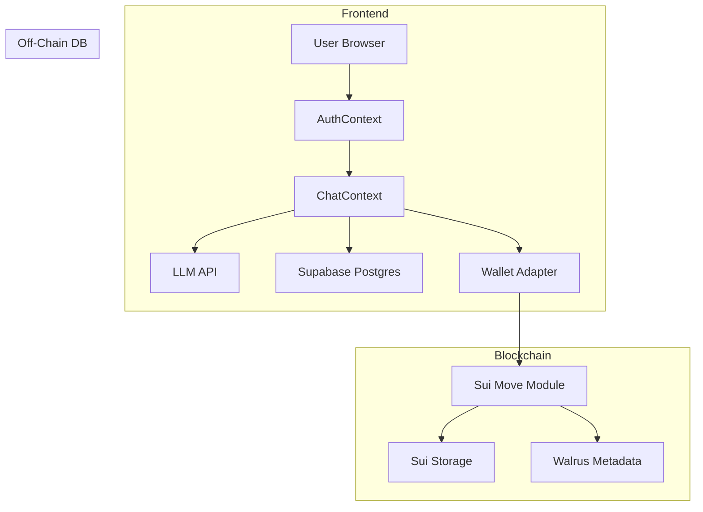

# TuriCheck Architecture

**New Name:** TuriCheck (formerly “Turing Test Booth”)

TuriCheck is a streamlined “Human or AI?” one-shot chat experience on Sui: users engage in a brief dialogue, make a single guess, and mint a collectible Badge NFT for correct answers.

**Tech Stack:**

* **Frontend:** Next.js (App Router, React 18), Tailwind CSS
* **DB & Auth:** Supabase (Auth + Postgres)
* **Blockchain:** Sui Move modules for Badge minting
* **Wallet:** @mysten/wallet-adapter-react, zkLogin integration for gasless sign-on
* **Off-chain Storage:** Walrus for Badge metadata
* **LLM Integration:** External AI API (e.g., OpenAI/Claude)

---

## 1. File & Folder Structure

```bash
/ (monorepo root)
├── apps
│   └── frontend                  # Next.js application
│       ├── public                # Static assets: favicon, logo
│       ├── src
│       │   ├── app
│       │   │   ├── layout.tsx       # Wraps providers & global styles
│       │   │   ├── page.tsx         # Landing / single-chat interface
│       │   │   ├── profile          # /profile: user badges gallery
│       │   │   │   └── page.tsx
│       │   │   └── demo             # /demo: admin view, stats
│       │   ├── components          # Reusable UI: <ChatBox>, <GuessForm>, <BadgeCard>
│       │   ├── context             # AuthContext, ChatContext
│       │   ├── hooks               # useUser, useChatSession, useBadges
│       │   ├── utils               # LLM API client, Sui tx builders, supabaseClient
│       │   ├── types               # TS interfaces: User, Session, Badge
│       │   └── styles              # Global CSS / Tailwind config
│       ├── .env.local             # NEXT_PUBLIC_SUPABASE_URL, ANON_KEY, AI_API_KEY, SUI_RPC
│       └── package.json
│
├── contracts
│   └── move                       # Sui Move modules
│       ├── src
│       │   └── TuriCheck.move       # entry: mint_badge(session_id, guess_correct)
│       └── tests                  # Move Prover unit tests
│
├── sdk                           # Optional TS SDK & CLI
│   ├── src
│   │   ├── index.ts              # export importSession, fetchBadges
│   │   └── mintBadge.ts          # wrap mint_badge call
│   └── package.json
│
├── .gitignore
└── README.md
```

---

## 2. Component Responsibilities

| Area                              | Responsibility                                                                           |
| --------------------------------- | ---------------------------------------------------------------------------------------- |
| **app/layout.tsx**                | Wraps `<AuthProvider>`, `<WalletProvider>`, global styles, and handles SSR layout.       |
| **app/page.tsx**                  | Landing & core flow: shows `<ChatBox>` for AI/human conversation, then `<GuessForm>`.    |
| **app/profile/page.tsx**          | Displays user’s minted badges using `useBadges()` hook.                                  |
| **app/demo/page.tsx**             | Admin dashboard: overall stats, total sessions, correct/incorrect rates.                 |
| **components/ChatBox.tsx**        | Renders chat UI: user message input, AI response streaming via LLM API, session state.   |
| **components/GuessForm.tsx**      | After chat ends, lets user guess “Human” or “AI”; triggers badge mint flow.              |
| **components/BadgeCard.tsx**      | Displays Badge NFT: image, session result, on-chain link.                                |
| **context/AuthContext.tsx**       | Manages Supabase Auth session, provides `user` and `signOut()`.                          |
| **context/ChatContext.tsx**       | Tracks current session ID, conversation buffer, guess state, and results.                |
| **hooks/useUser.ts**              | SWR hook fetching user profile and session count from Supabase.                          |
| **hooks/useChatSession.ts**       | Manages chat session state: createSession(), sendMessage(), endSession(), guessResult(). |
| **hooks/useBadges.ts**            | Fetches user’s badges from on-chain events or Walrus metadata pointers.                  |
| **utils/llmClient.ts**            | Wrapper for AI API calls (chat completion), streaming interface.                         |
| **utils/suiTx.ts**                | Builds and signs `mint_badge` transaction with Wallet Adapter.                           |
| **utils/supabaseClient.ts**       | Initializes Supabase client, functions for session logging in Postgres.                  |
| **contracts/move/TuriCheck.move** | Contains Move entry `mint_badge(owner: address, session_id: ID, correct: bool)`.         |

---

## 3. State & Service Flow



1. **Auth & Profile**: Supabase Auth issues JWT; user profile stored in `profiles` table.
2. **Session Creation**: On first message, Frontend calls Supabase Edge function to `create_session` (logs session\_id).
3. **Chat**: `ChatBox` sends user input to LLM API; streams responses; also stores messages in `ChatContext`.
4. **Guess**: User submits guess; Frontend calls Move `mint_badge(session_id, correct)` via `suiTx.ts`.
5. **On-Chain Badge**: Move module mints a Badge NFT to user; stores metadata pointer (session summary) in Walrus.
6. **Profile & Badges**: `useBadges()` queries on-chain events and Walrus to display badges in `/profile`.

---

## 4. Data & State Locations

| Data Type               | Location                                   |
| ----------------------- | ------------------------------------------ |
| **Auth Session**        | Supabase Auth (JWT in cookie/localStorage) |
| **User Profile**        | Supabase Postgres `profiles` table         |
| **Chat Sessions**       | Supabase Postgres `sessions` table         |
| **Conversation Buffer** | Frontend state (`ChatContext`)             |
| **Badge NFTs**          | Sui on-chain via Move storage              |
| **Badge Metadata**      | Walrus programmable storage                |
| **LLM API Keys**        | `.env.local` (never committed)             |

---

**This architecture ensures** a seamless TuriCheck experience: rapid chat, a single guess, and an instant on-chain reward—delivering maximum engagement with minimal complexity.
