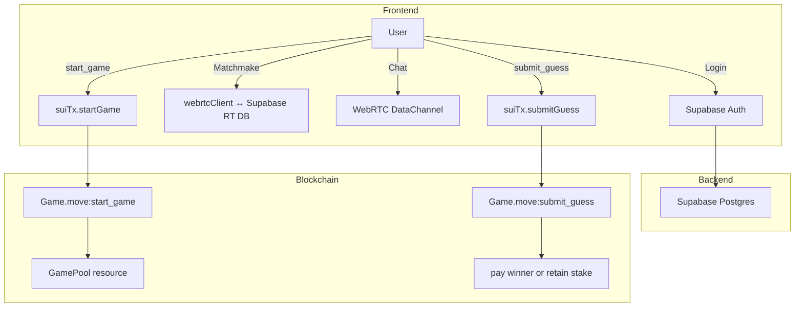

# TuriCheck Architecture & Ace Attorney Mode Extension

**Project Name:** TuriCheck (with *Ace Attorney Mode*)

TuriCheck is a “Human or AI?” chat game on Sui. In **Ace Attorney Mode**, two players (or player vs. AI) exchange up to 10 messages each, timed at 30 s per turn, in an Ace Attorney–style courtroom UI. Players stake SUI to join; a Move contract holds the stake and pays 1.25× on a correct guess or forfeits on wrong. Wallet-connected frontend handles matchmaking (peer-to-peer or AI), chat UI, timer, guessing, and transaction signing.

---

## 1. File & Folder Structure

```bash
/ (monorepo root)
├── apps
│   └── frontend                     # Next.js + React UI
│       ├── public                   # assets: icons, Ace Attorney sprites
│       ├── src
│       │   ├── app
│       │   │   ├── layout.tsx        # Wrap AuthProvider, WalletProvider
│       │   │   ├── page.tsx          # Home: lobby, mode select, stake amount
│       │   │   ├── game              # /game/[sessionId]
│       │   │   │   ├── layout.tsx    # Ace Attorney frame
│       │   │   │   ├── page.tsx      # Message list, timer, guess form
│       │   │   └── profile           # /profile: badge & earnings
│       │   ├── components           # <CourtroomUI>, <MessageBubble>, <Timer>, <GuessForm>
│       │   ├── context              # AuthContext, GameContext
│       │   ├── hooks                # useUser, useGameSession, useMatchmaking
│       │   ├── utils                # supabaseClient, web3Wallet, webrtcClient, suiTx
│       │   └── types                # TS types: User, Session, Message, Outcome
│       ├── .env.local               # SUPABASE_URL, SUPABASE_KEY, SUI_RPC
│       └── package.json
│
├── contracts
│   └── move                         # Sui Move game + staking module
│       ├── src
│       │   └── TuriCheck.move         # see full code below
│       └── tests                    # Move Prover tests for stake logic
│
├── sdk                              # Optional CLI/SDK utilities
│   └── src
│       ├── startGame.ts             # init session + stake
│       ├── submitGuess.ts           # guess and settle
│       └── withdrawFunds.ts         # owner withdrawal
│
├── .gitignore
└── README.md
```

---

## 2. Component Responsibilities

| Path                                 | Responsibility                                                                                 |
| ------------------------------------ | ---------------------------------------------------------------------------------------------- |
| **app/page.tsx**                     | Lobby: choose Ace Attorney Mode, enter stake, matchmaking.                                     |
| **app/game/\[sessionId]/layout.tsx** | Renders courtroom frame graphics and injects `<Children />`.                                   |
| **app/game/\[sessionId]/page.tsx**   | Core game: shows `<MessageBubble>` list, `<Timer>`, and `<GuessForm>` after 10 messages.       |
| **components/CourtroomUI.tsx**       | Ace Attorney–style background, character sprites, dialogue portrait.                           |
| **components/MessageBubble.tsx**     | Displays each chat line with speaker name and style.                                           |
| **components/Timer.tsx**             | 30 s countdown per turn, auto-skips/forfeits if time runs out.                                 |
| **components/GuessForm.tsx**         | After 10 messages, shows “Guess Human or AI” buttons; submits guess.                           |
| **context/GameContext.tsx**          | Holds `sessionId`, `messages[]`, `turnCount`, `stake`, `connectedPeer`, and game state.        |
| **hooks/useMatchmaking.ts**          | Peer-to-peer match via WebRTC signaling over Supabase; falls back to AI opponent.              |
| **hooks/useGameSession.ts**          | CRUD session in Supabase: create, update messages, record guess and outcome.                   |
| **utils/webrtcClient.ts**            | WebRTC peer connection helper: signaling channel in Supabase real-time, data channel for chat. |
| **utils/suiTx.ts**                   | Builds and sends SUI staking & settle transactions via Wallet Adapter.                         |
| **contracts/move/TuriCheck.move**    | Move module implementing `start_game`, `submit_guess`, `withdraw`.                             |

---

## 3. State & Service Connections

* **Authentication:** Supabase Auth issues JWT, `profiles` table holds user info and ratings.
* **Matchmaking & P2P:** Supabase real-time DB for signaling; WebRTC data channel carries chat messages.
* **Session Persistence:** Sessions stored off-chain in Supabase `sessions` table (sessionId, players, stake, messages, guess, outcome).
* **Blockchain Staking:** Move module holds stakes in `GamePool` resource; Wallet Adapter txs call entry functions.
* **Outcome Settlement:** On correct guess, Move module releases 1.25× stake to winner; else stake is forfeited to pool.



---

## 4. Move Contract: Full Code & Deployment

```move
address 0x1 {
module TuriCheck {
    use sui::object::{UID, ID};
    use sui::balance::{Balance, withdraw, deposit};
    use sui::transfer;

    /// Resource holding the pool of stakes
    struct GamePool has key {
        id: UID,
        total_staked: u64,
    }

    /// Session info stored on-chain
    struct GameSession has key {
        id: UID,
        player1: address,
        player2: address,
        stake: u64,
        settled: bool,
    }

    /// Initialize the pool once
    public entry fun init_pool(owner: &signer) {
        move_to(owner, GamePool { id: UID::new(), total_staked: 0 });
    }

    /// Start a game by staking
    public entry fun start_game(
        initiator: &signer,
        opponent: address,
        stake_amount: u64,
    ) {
        let pool = borrow_global_mut<GamePool>(@0x1);
        // withdraw SUI from initiator
        let coins = withdraw(initiator, stake_amount);
        deposit(&mut pool.total_staked, coins);
        let session = GameSession {
            id: UID::new(),
            player1: signer::address_of(initiator),
            player2: opponent,
            stake: stake_amount,
            settled: false,
        };
        move_to(initiator, session);
    }

    /// Submit guess, settle the stake
    public entry fun submit_guess(
        player: &signer,
        session_id: ID,
        guess_human: bool
    ) {
        let mut session = borrow_global_mut<GameSession>(@0x1, session_id);
        assert!(!session.settled, 1);
        // determine correct (for MVP, pass correct value as param or compute)
        let correct = SessionOracle::is_human(session_id);
        let winner = if (guess_human == correct) { signer::address_of(player) } else { if (signer::address_of(player) == session.player1) { session.player2 } else { session.player1 }};
        let payout = session.stake * 125 / 100;
        let pool = borrow_global_mut<GamePool>(@0x1);
        let coins = withdraw(pool, payout);
        deposit(&mut signer::address_of(winner), coins);
        session.settled = true;
    }
}
}
```

**Deployment Steps:**

1. **Compile & Publish:**

   ```bash
   cd contracts/move
   sui move build
   sui client publish --gas-budget 10000
   ```
2. **Record Addresses:** Update `packages/frontend/.env.local` with `GAME_MODULE_ID` and `GAME_PUBLISHER`.

---

## 5. Move Contract: Detailed Explanation & Integration

### 5.1 Contract Resources & Entry Functions

1. **GamePool** (singleton)

   ```move
   struct GamePool has key {
       id: UID,
       total_staked: u64,
   }
   ```

   * Holds all staked coins. Initialized once via `init_pool`.

2. **GameSession**

   ```move
   struct GameSession has key {
       id: UID,
       player1: address,
       player2: address,
       stake: u64,
       settled: bool,
   }
   ```

   * Represents one match. Stored under the initiator’s account after `start_game`.

3. **init\_pool(owner: \&signer)**

   * Creates a single `GamePool` resource under the owner. Call once post-deploy.

4. **start\_game(initiator: \&signer, opponent: address, stake\_amount: u64)**

   * **Frontend call:** `suiTx.startGame(opponentAddr, stakeAmount)`
   * **Process:** withdraws `stake_amount` SUI from initiator, deposits into `GamePool.total_staked`, mints a new `GameSession` with unique `id`, players, and stake.
   * **Returns:** the `GameSession.id` (UID) used as `sessionId` in the frontend.

5. **submit\_guess(player: \&signer, session\_id: ID, guess\_human: bool)**

   * **Frontend call:** `suiTx.submitGuess(sessionId, guessHuman)`
   * **Process:** fetches `GameSession`, checks `!settled`, compares `guess_human` to truth (provided by off-chain oracle or passed in for MVP), computes `payout = stake * 125/100`, withdraws `payout` from `GamePool`, deposits to winner’s address, marks session settled.

6. **withdraw\_pool(owner: \&signer)** (optional)

   * Allows owner or platform to withdraw accumulated forfeited stakes.

### 5.2 Frontend Integration

1. **startGame Flow**

   * User selects mode (Ace Attorney or Normal) and enters stake.
   * Matchmaking returns `opponentAddress` (or a designated AI address).
   * Call `buildStartGameTx(opponentAddress, stake)` in `utils/suiTx.ts`, then `signAndExecuteTransaction(tx)`.
   * Extract `sessionId` from transaction events (listen for `GameSession` creation event) and store in `GameContext`.

2. **submitGuess Flow**

   * After chat completes (10 messages or time expiry), user picks guess.
   * Call `buildSubmitGuessTx(sessionId, guessHuman)` then `signAndExecuteTransaction(tx)`.
   * Await confirmation event; read success/failure and payout amount from event data.
   * Update UI: show animated 1.25× badge or “you lost” message.

3. **GameContext**

   * Holds `sessionId`, `stake`, `player1`, `player2`, and game `outcome`.
   * On `start_game` success, populate `sessionId` and `stake`.
   * On `submit_guess`, update `outcome` (`win` or `lose`) and optional `payout`.

4. **Wallet & Events**

   * Use `@mysten/wallet-adapter-react` to connect wallet and send transactions.
   * Listen for `Transaction` events in the frontend; use `suiTx.onSuccess(txId, callback)` to parse event logs.

### 5.3 Deployment Steps

1. **Build & Publish**

   ```bash
   cd contracts/move
   sui move build
   sui client publish --gas-budget 10000
   ```

   * Note the returned `packageId` and module address.

2. **Initialize Pool**

   * In a script or REPL:

     ```ts
     import { provider, signer } from './suiConfig';
     const tx = buildInitPoolTx();
     await signer.signAndExecuteTransaction(tx);
     ```

3. **Configure Frontend**

   * In `apps/frontend/.env.local`, set:

     ```bash
     NEXT_PUBLIC_GAME_MODULE=<packageId>::TuriCheck
     NEXT_PUBLIC_GAME_PUBLISHER=<publisherAddress>
     ```

4. **MVP Demo**

   * Deploy frontend to Vercel.
   * Ensure `init_pool` has been called.
   * Demo flow: lobby → stake and `start_game` tx → chat rounds → `submit_guess` tx → payout.

---

With these details, you can wire the Move contract into your Next.js frontend, handle match outcomes, and deploy both contract and UI for a complete TuriCheck Ace Attorney Mode experience.
